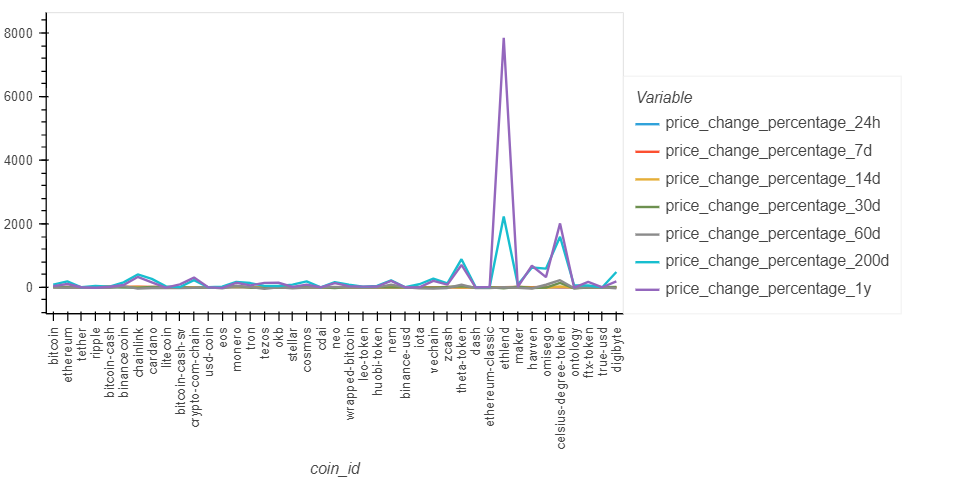
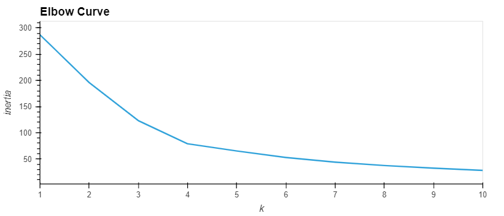
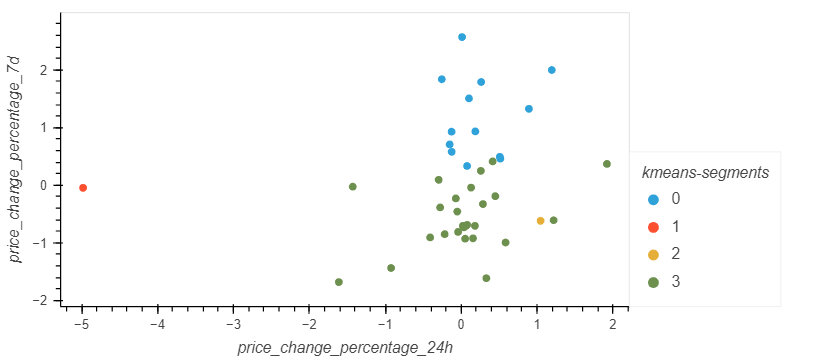
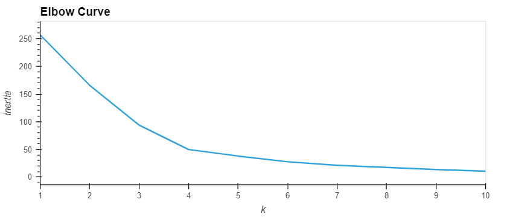
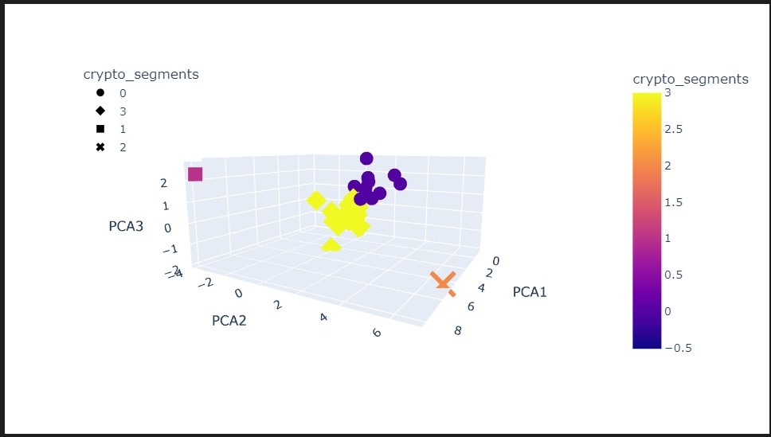
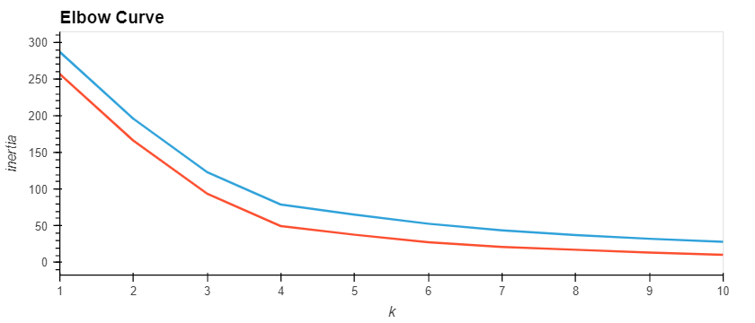

# Challenge19-Cryptoclustering
## <b>
Cryptocurrencies Clustering - Challenge 18
</b>

<b> Looking at the Cryptocurrencies:</b>

The dataset contains price changes for each coin over a wide selection of time periods:  1, 7, 14, 30, 60, 200 and 365 days.  This data is plotted below:

The data was scaled using StandardScaler, and then a Kmeans model was applied to determine inertia and plot an elbow curve to determine the best value of k using the scaled data.

THe best value of k was determined to be <b>k = 4</b>.  The Kmeans model with a k value of 4 was applied to the scaled data to best find the predicted clusters.  A scatter plot of the clusters was then plotted below.

The scaled data was then used to create a PCA model with 3 components.  The PCA data was then put into a new dataframe, and this new dataframe was used to determine inertia and plot a new elbow curve to determine the best value of k using PCA.  The elbow curve is plotted below.

THe best value of k was again determined to be <b>k = 4</b>.  The Kmeans model with a k value of 4 was applied to the PCA data to best find the predicted clusters.  A scatter plot of the clusters was then plotted below.  As 3 PCA components were used, a 3D plot was required and the plot was made with plotly.

The two elbow curves were plotted on the seame graph, in order to compare the differences between the two approaches.  The graph below indicaes that the PCA approach had a slightly lower inertia, and thus was slightly more accurate.  The most obvious difference was that the yellow coin (Celsius-Degree token) appeared to be located within the greeen cluster using the Kmeans apprach, but the 3 component PCA model showed that the Celsius-Degree token was actually separated from the green group on the third axis/component.

